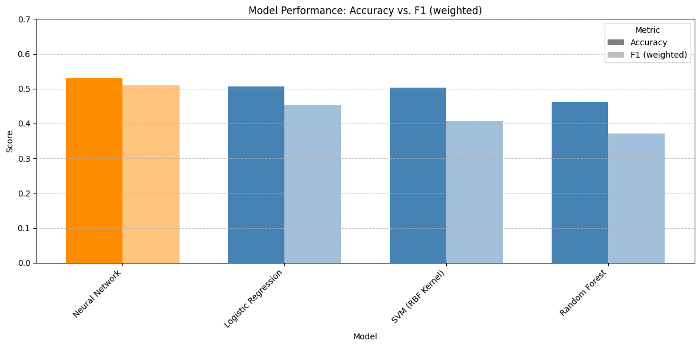
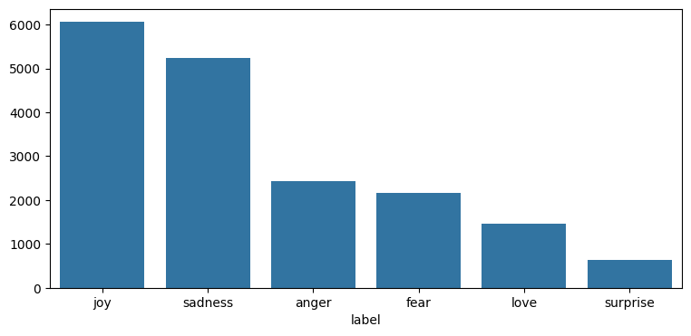
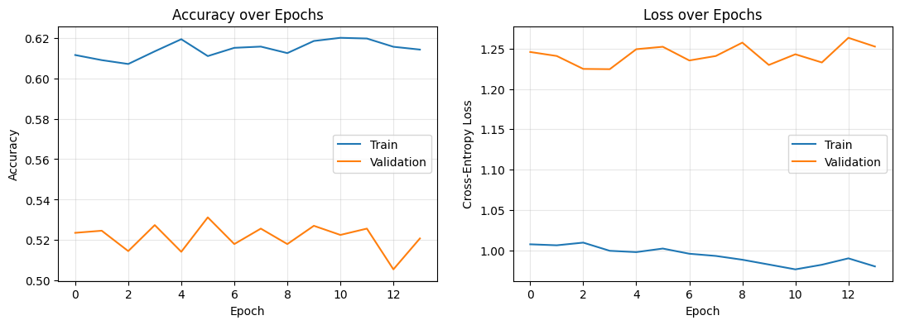

# Emotion Classification using Word2Vec Embeddings & Deep Learning

  

This project explores Natural Language Processing (NLP) techniques for multi-class emotion classification using both traditional machine learning models and deep learning. The goal was to classify text into emotional categories such as sadness, joy, love, anger, fear, and surprise.

Instead of relying on simple bag-of-words representations, the project uses Word2Vec embeddings to transform words into dense semantic vectors that capture contextual meaning between words.

---

## Project Workflow

### Exploratory Data Analysis (EDA)

  

The dataset was analyzed to understand:
- class distribution  
- sentence lengths  
- dataset balance  
- text structure  

Visualizations were created to inspect emotion frequencies and text characteristics before training.

---

## Text Preprocessing

The text data was cleaned and prepared using:
- lowercase conversion  
- punctuation removal  
- tokenization  
- filtering short tokens  

The processed text was then used to train custom Word2Vec embeddings.

---

## Word2Vec Embeddings

A custom Word2Vec model was trained using the Skip-Gram architecture to learn semantic relationships between words. The embeddings were tested by exploring similar terms for different emotions to validate contextual understanding.

Each sentence was converted into a fixed-length vector by averaging the embeddings of all words in the sentence.

---

## Model Comparison

Multiple machine learning models were trained and compared using the generated sentence embeddings:

- Logistic Regression  
- SVM (RBF Kernel)  
- Random Forest  

The models were evaluated using:
- Accuracy  
- Weighted F1-Score  
- Confusion Matrices  

---

## Deep Learning Model

A neural network was also implemented using TensorFlow/Keras with:
- dense layers  
- dropout regularization  
- ReLU activations  
- softmax output layer  

The training process was monitored using validation metrics and visualized through accuracy and loss curves.

  

---
---

## Final Results — Word2Vec Embeddings

| Model | Type | Accuracy | F1 (weighted) |
|---|---|---|---|
| Neural Network | NN | 0.5294 | 0.5090 |
| Logistic Regression | ML | 0.5069 | 0.4515 |
| SVM (RBF Kernel) | ML | 0.5022 | 0.4071 |
| Random Forest | ML | 0.4631 | 0.3710 |

---
## Key Learning Outcomes

This project demonstrates:
- NLP preprocessing workflows  
- semantic embeddings using Word2Vec  
- sentence vector generation  
- emotion classification using ML and deep learning  
- comparison between multiple NLP classification approaches  

Most importantly, it shows how human language can be transformed into numerical representations that machine learning models can understand and classify.

---

## Technologies Used

- Python  
- Pandas  
- NumPy  
- Matplotlib  
- Seaborn  
- Scikit-learn  
- Gensim (Word2Vec)  
- TensorFlow / Keras  

---