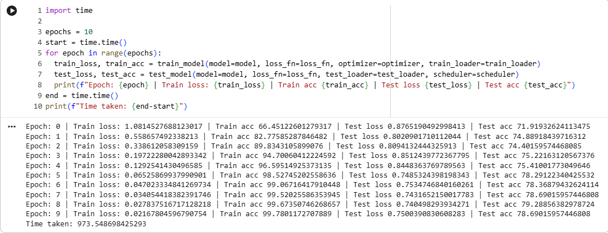
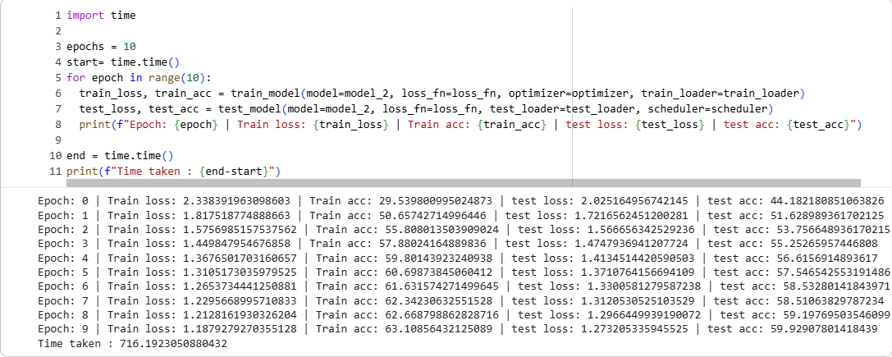
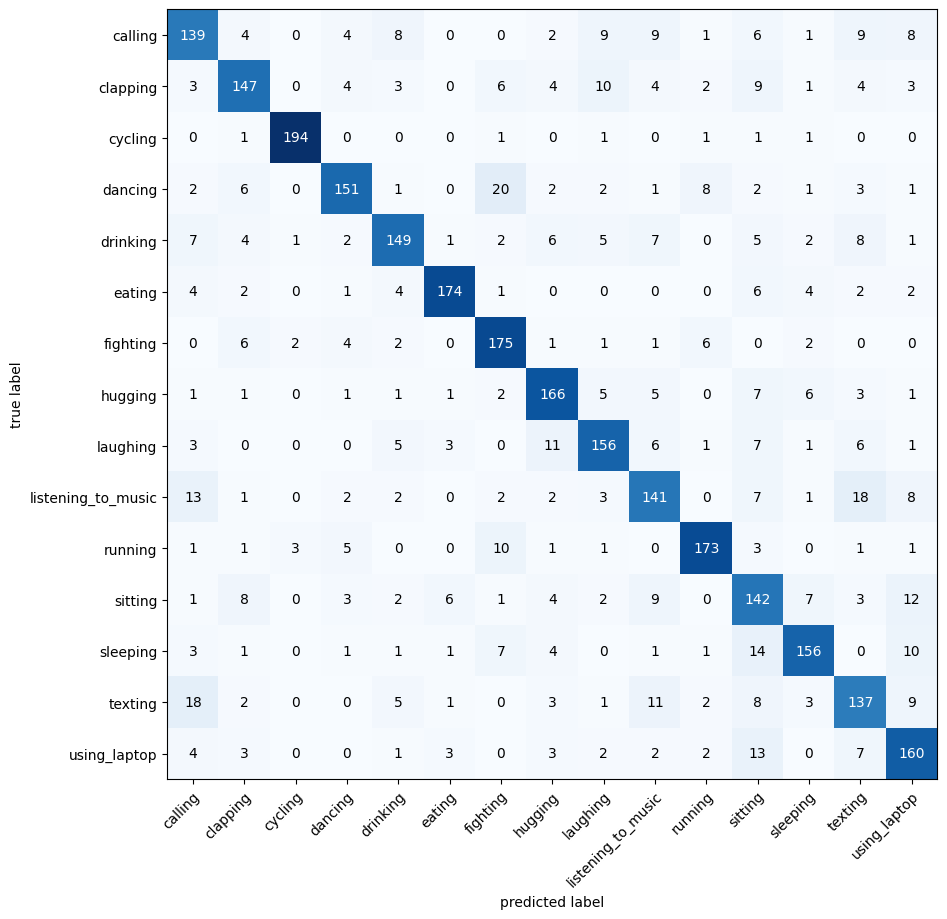

# Human Action Classification — ResNet18 Transfer Learning with PyTorch

This project explores **image classification and transfer learning using PyTorch** to recognize different human actions from images.

Instead of training a CNN from scratch, the project uses an **ImageNet-pretrained ResNet18** and compares two different transfer learning strategies:

- **Full Fine-Tuning** — training the entire pretrained network on the new dataset
- **Feature Extraction** — freezing the ResNet18 backbone and training only the final classification layer

The goal was to understand how pretrained visual features can be transferred to a new computer vision task and how the two approaches compare.

---

## Data Preparation

The image dataset was loaded using PyTorch's `ImageFolder` and prepared using separate training and testing transformation pipelines.

Training transformations included:

- Resize to `224 × 224`
- Random horizontal flipping
- Tensor conversion
- ImageNet normalization

The test dataset used the same preprocessing without random augmentation to maintain consistent evaluation.

Data was then loaded in batches using PyTorch `DataLoader`.

---

## Transfer Learning with ResNet18

An **ImageNet-pretrained ResNet18** was used as the base architecture.

The original 1000-class classification layer was replaced with a new fully connected layer matching the number of human-action classes in the dataset.

Two approaches were then tested.

### Model 1 — Full Fine-Tuning

The entire ResNet18 network remained trainable, allowing both the pretrained feature extractor and the new classification layer to adapt to the human-action dataset.

### Model 2 — Frozen Feature Extractor

All pretrained ResNet18 layers were frozen and only the newly added classification layer was trained.

This significantly reduced the number of trainable parameters and allowed the pretrained network to act as a fixed visual feature extractor.

---

## Training Pipeline

A custom PyTorch training and evaluation pipeline was implemented using:

- Cross-Entropy Loss
- Adam optimizer
- `ReduceLROnPlateau` learning-rate scheduler
- GPU acceleration when CUDA is available
- Custom accuracy calculation
- Separate training and evaluation loops

The pipeline tracked:

- Training loss
- Training accuracy
- Test loss
- Test accuracy
- Training time

  

  

---

## Model Evaluation

Both transfer-learning strategies were evaluated on the human-action test dataset.

In addition to overall accuracy and loss, **multiclass confusion matrices** were generated to analyze which human actions were correctly classified and which classes were commonly confused.

Single-image inference was also performed to test the trained models on individual unseen images.

  

---

## Key Learning Outcomes

This project demonstrates:

- Image classification with PyTorch
- Transfer learning using pretrained CNNs
- ResNet18 architecture adaptation
- Full fine-tuning vs frozen feature extraction
- Image preprocessing and data augmentation
- Custom PyTorch training and evaluation loops
- Learning-rate scheduling
- GPU-accelerated training
- Multiclass confusion matrix analysis
- Single-image inference

Most importantly, the project demonstrates how **pretrained deep learning models can be adapted to new computer vision tasks using different transfer-learning strategies instead of training a network entirely from scratch.**

---

## Technologies Used

- Python
- PyTorch
- Torchvision
- ResNet18
- TorchMetrics
- Torchinfo
- NumPy
- Matplotlib
- CUDA

---